# Wiring Configurations

[Download Wiring Diagrams (PDF)](assets/AGR25-01_Wiring_Diagrams.pdf){ .md-button .md-button--primary }

## Terminal Block Overview

| Terminal | Name | Description |
|---|---|---|
| **N** | Neutral | Neutral conductor |
| **L** | Line | Line conductor |
| **RL1** | Relay 1 | ON/OFF output 230V~ — Fan high speed (FH) |
| **RL2** | Relay 2 | ON/OFF output 230V~ — Fan medium speed (FM) |
| **RL3** | Relay 3 | ON/OFF output 230V~ — Fan low speed (FL) — or heater depending on config. |
| **RL4** | Relay 4 | ON/OFF output 230V~ — Heating valve (HV) |
| **RL5** | Relay 5 | ON/OFF output 230V~ — Cooling valve (CV) or heater depending on config. |
| **G** | 0V Ref. | 0V reference for DAC outputs and S1/S2 inputs |
| **DAC1** | 0-10V output | Proportional signal — Heating valve (HV) |
| **DAC2** | 0-10V output | Proportional signal — Cooling valve (CV) |
| **DAC3** | 0-10V output | Proportional signal — Fan |
| **B** | Reserved | Reserved — do not connect |
| **A** | Reserved | Reserved — do not connect |
| **S1** | Input 1 | External sensor |
| **S2** | Input 2 | External sensor |

!!! info "Galvanic Isolation"
    The terminal block is divided into two isolated zones: **230V~ section** (N, L, RL1–RL5) and **low voltage section** (G, DAC1–DAC3, B, A, S1, S2).

### Wiring Specifications

| Parameter | Value |
|---|---|
| Wire gauge — 230V section (N, L, RL1–RL5) | 1.5 mm² |
| Wire gauge — LV section (G, DAC, S1, S2) | 0.5 to 0.75 mm² |
| Max. cable length DAC 0-10V | 20 m |
| Max. cable length sensors S1/S2 | 20 m |
| Shielded cable | Recommended beyond 10 m |
| Wire type | Solid or stranded wire with crimped ferrule |

## Control Types

| Type | Description |
|---|---|
| **ON/OFF (Relay)** | Via relay outputs RL1–RL5. Including 3-speed fan mode (3 ON/OFF relays, one per speed). |
| **0-10V (Proportional)** | Via DAC outputs DAC1–DAC3. Proportional analog signal for modulating actuators. |

## Output Abbreviations

| Abbreviation | Meaning |
|---|---|
| FH | Fan High Speed |
| FM | Fan Medium Speed |
| FL | Fan Low Speed |
| HV | Heating Valve (Hot Valve) |
| CV | Cooling Valve (Cold Valve) |
| HR | Electric Heater — via external power contactor |
| Fan | Fan (0-10V proportional) |
| N/S | Not Supported |

## Diagram Symbols

The following pictograms are used in the wiring diagrams below:

| Symbol | Component |
|:---:|---|
| { .picto-icon } | **Fan** — Fan coil motor (3-speed or 0-10V) |
| { .picto-icon } | **Valve** — Heating (HV) or Cooling (CV) valve actuator |
| 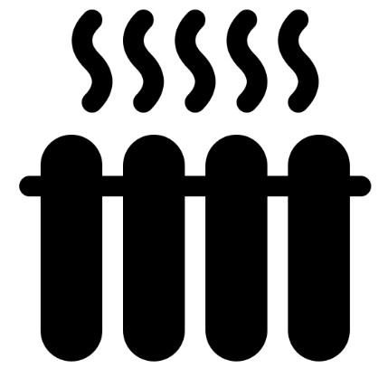{ .picto-icon } | **Electric Heater** — Via external power contactor (HR) |

!!! danger "Safety Warning"
    HR (electric heater) must **NEVER** be directly switched by relay. Always use an external power contactor.

## No Valve

Fan coil unit without control valve.

| # | Configuration | Fan | Valves | Heater | Output Assignment | Status |
|---|---|---|---|---|---|---|
| 1 | Fan Only | 3-speed | — | — | RL1=FH, RL2=FM, RL3=FL | **OK** |
| 2 | Fan Only | 0-10V | — | — | DAC3=Fan | **OK** |

**Configuration #1 — Fan 3-speed**

**Configuration #2 — Fan 0-10V**

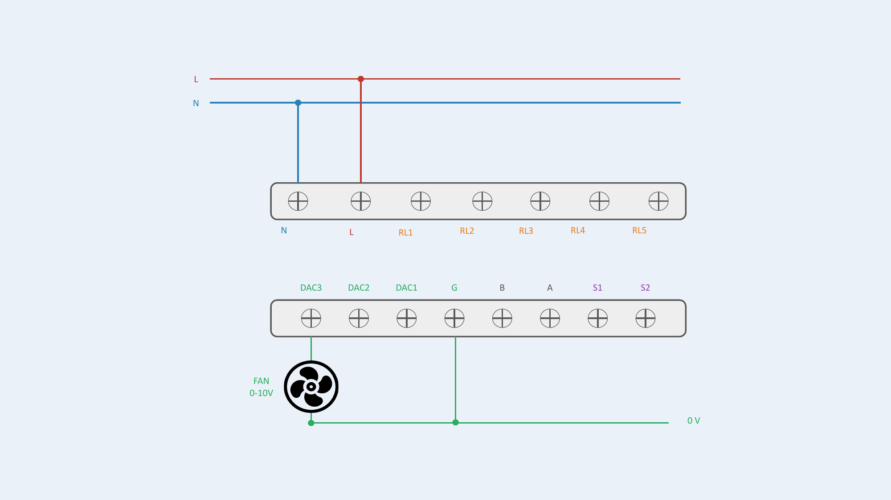

## No Valve + Electric Heater

Fan coil unit without valve, with electric heater.

| # | Configuration | Fan | Valves | Heater | Output Assignment | Status |
|---|---|---|---|---|---|---|
| 3 | Fan Only + Electric Heater | 3-speed | — | ON/OFF | RL1=FH, RL2=FM, RL3=FL, RL5=HR | **OK** |
| 4 | Fan Only + Electric Heater | 0-10V | — | ON/OFF | DAC3=Fan, RL5=HR | **OK** |

!!! danger "Heater Safety"
    HR (electric heater) must NEVER be directly switched by relay. Use an external power contactor.

**Configuration #3 — Fan 3-speed / Heater ON/OFF**

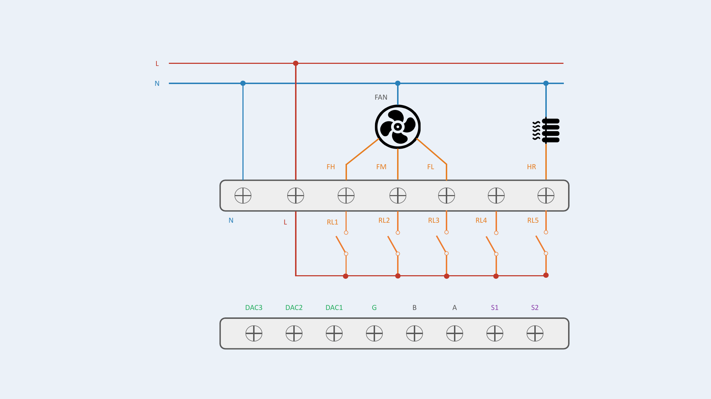

**Configuration #4 — Fan 0-10V / Heater ON/OFF**

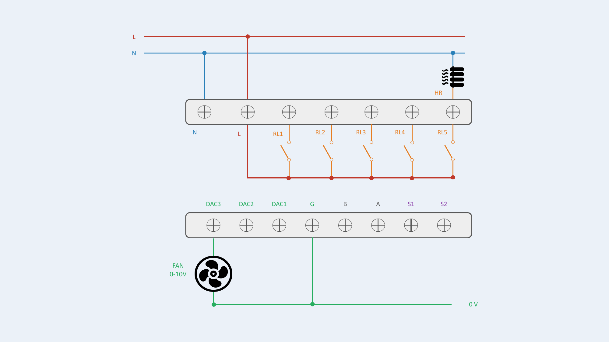

## 2-Pipe (2P)

Fan coil unit with 1 valve (2P changeover, 2P heating only or 2P cooling only). The single valve is always connected to HV: RL4 for ON/OFF, DAC1 for 0-10V.

| # | Configuration | Fan | Valves | Heater | Output Assignment | Status |
|---|---|---|---|---|---|---|
| 5 | 2P: Fan + 1 Valve | 3-speed | ON/OFF | — | RL1=FH, RL2=FM, RL3=FL, RL4=HV | **OK** |
| 6 | 2P: Fan + 1 Valve | 3-speed | 0-10V | — | RL1=FH, RL2=FM, RL3=FL, DAC1=HV | **OK** |
| 7 | 2P: Fan + 1 Valve | 0-10V | ON/OFF | — | DAC3=Fan, RL4=HV | **OK** |
| 8 | 2P: Fan + 1 Valve | 0-10V | 0-10V | — | DAC1=HV, DAC3=Fan | **OK** |

**Configuration #5 — Fan 3-speed / Valve ON/OFF**

**Configuration #6 — Fan 3-speed / Valve 0-10V**

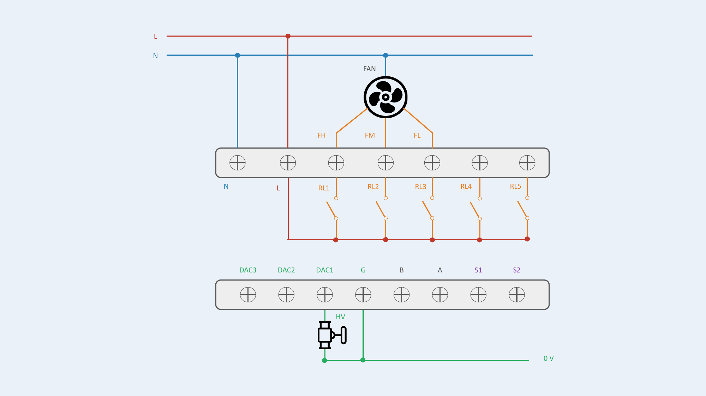

**Configuration #7 — Fan 0-10V / Valve ON/OFF**

**Configuration #8 — Fan 0-10V / Valve 0-10V**

## 2-Pipe + Electric Heater (2P + 2 wires)

2-pipe fan coil unit with electric heater.

| # | Configuration | Fan | Valves | Heater | Output Assignment | Status |
|---|---|---|---|---|---|---|
| 9 | 2P + Heater: Fan + 1 Valve + Heater | 3-speed | ON/OFF | ON/OFF | RL1=FH, RL2=FM, RL3=FL, RL4=HV, RL5=HR | **OK** |
| 10 | 2P + Heater: Fan + 1 Valve + Heater | 3-speed | 0-10V | ON/OFF | RL1=FH, RL2=FM, RL3=FL, DAC1=HV, RL5=HR | **OK** |
| 11 | 2P + Heater: Fan + 1 Valve + Heater | 0-10V | ON/OFF | ON/OFF | DAC3=Fan, RL4=HV, RL5=HR | **OK** |
| 12 | 2P + Heater: Fan + 1 Valve + Heater | 0-10V | 0-10V | ON/OFF | DAC1=HV, DAC3=Fan, RL5=HR | **OK** |

!!! danger "Heater Safety"
    HR (electric heater) must NEVER be directly switched by relay. Use an external power contactor.

**Configuration #9 — Fan 3-speed / Valve ON/OFF / Heater ON/OFF**

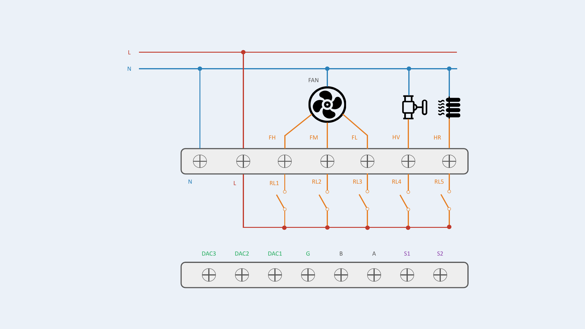

**Configuration #10 — Fan 3-speed / Valve 0-10V / Heater ON/OFF**

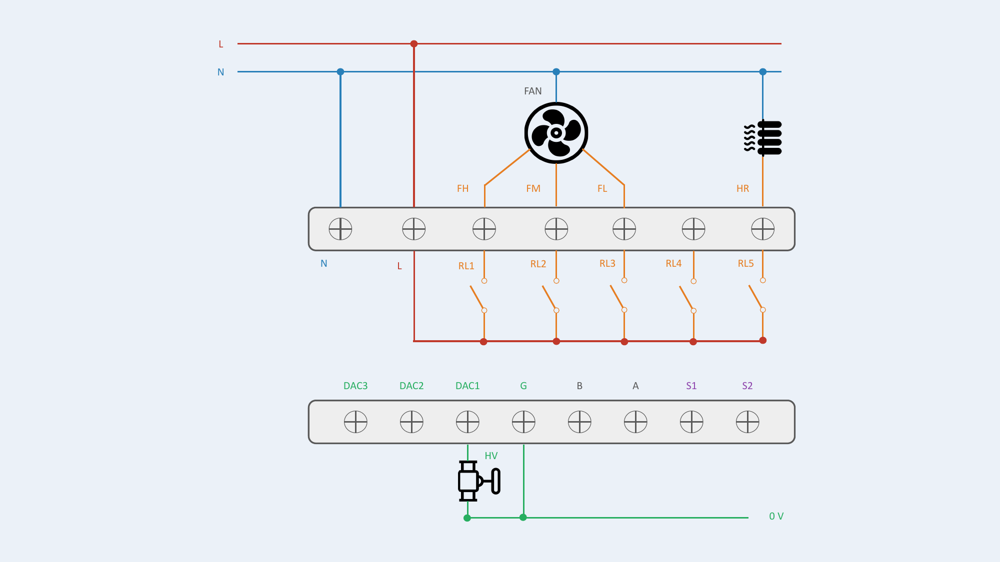

**Configuration #11 — Fan 0-10V / Valve ON/OFF / Heater ON/OFF**

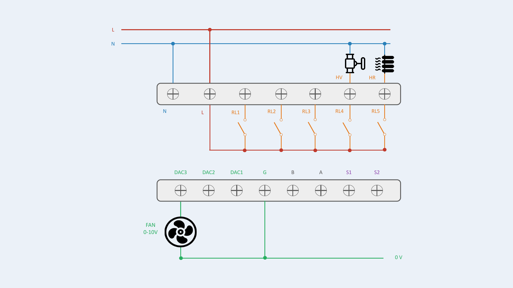

**Configuration #12 — Fan 0-10V / Valve 0-10V / Heater ON/OFF**

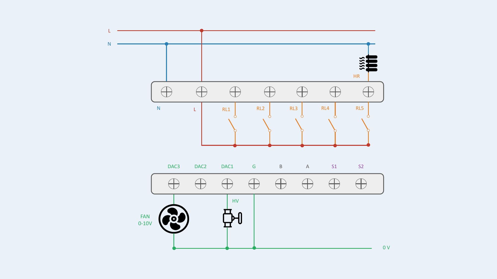

## 4-Pipe (4P)

Fan coil unit with 2 independent valves (heating + cooling).

| # | Configuration | Fan | Valves | Heater | Output Assignment | Status |
|---|---|---|---|---|---|---|
| 13 | 4P: Fan + 2 Valves | 3-speed | ON/OFF | — | RL1=FH, RL2=FM, RL3=FL, RL4=HV, RL5=CV | **OK** |
| 14 | 4P: Fan + 2 Valves | 3-speed | 0-10V | — | RL1=FH, RL2=FM, RL3=FL, DAC1=HV, DAC2=CV | **OK** |
| 15 | 4P: Fan + 2 Valves | 0-10V | ON/OFF | — | DAC3=Fan, RL4=HV, RL5=CV | **OK** |
| 16 | 4P: Fan + 2 Valves | 0-10V | 0-10V | — | DAC1=HV, DAC2=CV, DAC3=Fan | **OK** |

**Configuration #13 — Fan 3-speed / Valves ON/OFF**

**Configuration #14 — Fan 3-speed / Valves 0-10V**

**Configuration #15 — Fan 0-10V / Valves ON/OFF**

**Configuration #16 — Fan 0-10V / Valves 0-10V**

## 4-Pipe + Electric Heater (4P + 2 wires)

4-pipe fan coil unit with electric heater.

| # | Configuration | Fan | Valves | Heater | Output Assignment | Status |
|---|---|---|---|---|---|---|
| 17 | 4P + Heater: Fan + 2 Valves + Heater | 3-speed | 0-10V | ON/OFF | RL1=FH, RL2=FM, RL3=FL, DAC1=HV, DAC2=CV, RL5=HR | **OK** |
| 18 | 4P + Heater: Fan + 2 Valves + Heater | 0-10V | ON/OFF | ON/OFF | DAC3=Fan, RL4=HV, RL5=CV, RL3=HR | **OK** |
| 19 | 4P + Heater: Fan + 2 Valves + Heater | 0-10V | 0-10V | ON/OFF | DAC1=HV, DAC2=CV, DAC3=Fan, RL5=HR | **OK** |
| 20 | 4P + Heater: Fan + 2 Valves + Heater | 3-speed | ON/OFF | ON/OFF | — | **N/S** |

!!! danger "Heater Safety"
    HR (electric heater) must NEVER be directly switched by relay. Use an external power contactor.

!!! warning "Configuration #20 — Not Supported"
    Not enough relays available to handle this configuration. If this configuration is selected, outputs remain disabled for safety.

Each output supports invertible logic (NO / NC) individually configurable.

**Configuration #17 — Fan 3-speed / Valves 0-10V / Heater ON/OFF**

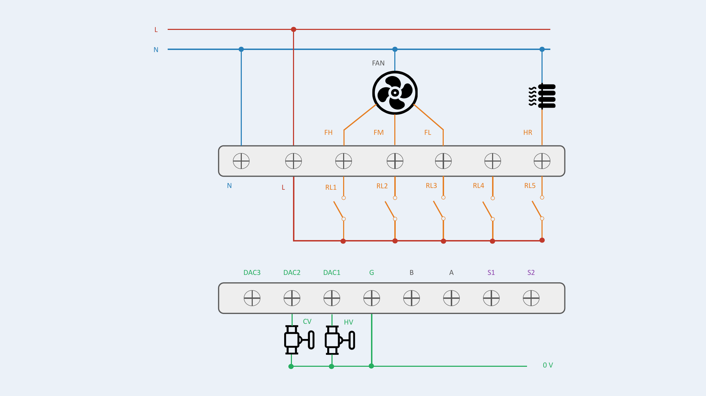

**Configuration #18 — Fan 0-10V / Valves ON/OFF / Heater ON/OFF**

**Configuration #19 — Fan 0-10V / Valves 0-10V / Heater ON/OFF**

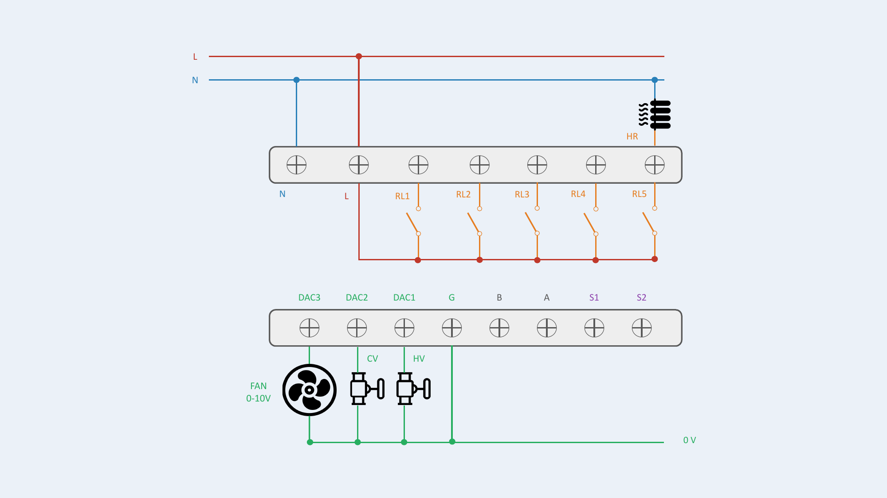

## External Sensors (S1, S2)

Inputs S1 and S2 accept two types of sensors, configurable from the screen or the AGRID server.

### Analog Sensor (Thermistor)

Remote temperature measurement.

| Sensor Type | Connection | Input | Signal | Applications |
|---|---|---|---|---|
| Thermistor | S1 or S2 + G (0V ref) | Analog | Resistance variation | Supply / outdoor / return air temp, pipe changeover detection (2-pipe auto H/C switching) |

**Wiring notes:**

- Connect thermistor between S1 (or S2) and G
- No external power supply needed
- 2-wire, no polarity
- Max cable length: 20 m

**Supported thermistors:**

- NTC 5K
- NTC 10K Type II & Type III
- NTC 20K
- PT1000
- PT 500

**Configuration:** sensor type must be set via the thermostat parameter screen or via the AGRID App (or BMS).

### Digital Sensor (Dry Contact)

ON/OFF state detection.

| Sensor Type | Connection | Input | Signal | Applications |
|---|---|---|---|---|
| Dry Contact (Switch) | S1 or S2 + G (0V ref) | Digital | ON/OFF state | Window detector, key card, badge |

**Wiring notes:**

- Connect switch between S1 (or S2) and G
- No external power supply needed
- Voltage-free contact only
- Max cable length: 20 m

**Applications:** window open/close detector, key card / badge presence, any voltage-free contact.

**Configuration:** sensor type must be set via the thermostat parameter screen or via the AGRID App (or BMS).

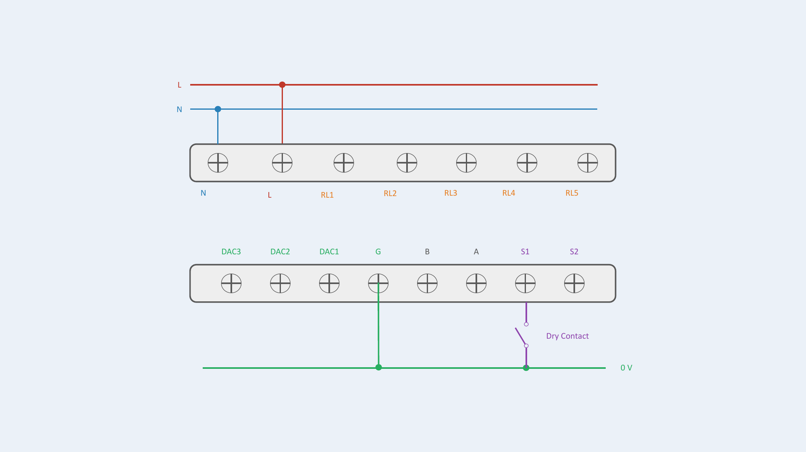

### PIR Motion Detector

External PIR detector with dry contact output.

| Sensor Type | Connection | Input | Signal | Power Supply |
|---|---|---|---|---|
| PIR Motion Detector | S1 or S2 + G (0V ref) | Digital | ON/OFF (dry contact) | External (separate PSU) |

**Wiring notes:**

- Connect PIR dry contact output between S1 (or S2) and G
- PIR requires its own external power supply
- Refer to PIR sensor manual for power supply specifications

**Configuration:** sensor type must be set via the thermostat parameter screen or via the AGRID App (or BMS).

!!! warning "External Power Supply Required"
    The PIR sensor requires an external power supply. Refer to the PIR sensor's instructions to ensure proper galvanic isolation and safety when connecting it to the thermostat. The external PSU must be isolated from the thermostat's low-voltage zone.

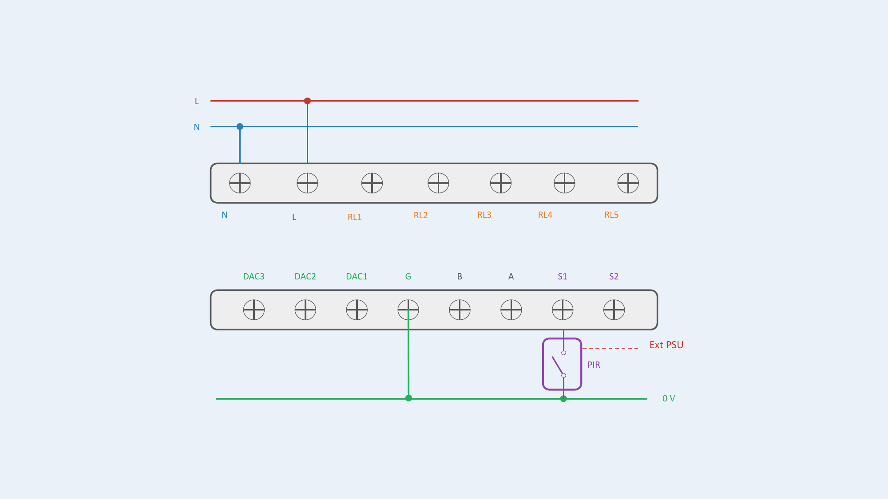
