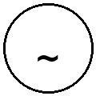
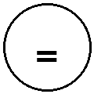
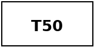
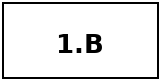

# Installation et câblage

## Avertissements de sécurité

!!!warning "⚠ Danger électrique"
    **Intervention réservée à un électricien qualifié**

    - Couper l'alimentation électrique avant toute intervention
    - Vérifier l'absence de tension avant de travailler sur l'installation
    - Respecter les normes d'installation électrique en vigueur dans votre pays

!!!danger "Dispositif de sectionnement omnipolaire"
    Un **dispositif de sectionnement omnipolaire** avec **distance de contacts de 3 mm minimum** doit être accessible et facilement actionnable par l'utilisateur.

!!!warning "Environnement et boîtier"
    - **Intérieur sec uniquement** - Protection IP20
    - **Ne pas ouvrir le boîtier** - Les travaux internes sont réservés aux techniciens autorisés AGRID
    - Ne pas exposer à l'humidité, vapeur ou condensation

!!!danger "Sorties relais - Signal de commande uniquement"
    Les sorties relais (RL1-RL5) fournissent un **signal de commande uniquement**. Pour commuter des **résistances électriques ou charges de puissance**, un **contacteur externe** doit obligatoirement être utilisé.

    Les relais ne doivent jamais commutatrice directement une charge de puissance.

## Instructions de montage

### Localisation et placement

Le thermostat doit être installé :

- **Montage mural** uniquement
- **Hauteur maximale : 2 mètres** du sol
- **À l'écart** des sources de chaleur (radiateurs, exposition solaire directe)
- **À l'écart** des courants d'air directs (portes, fenêtres, ventilations)
- **À l'écart** des zones mortes thermiques (coins mal ventilés, recoins)
- **À l'intérieur** dans un environnement sec et protégé (IP20)

### Procédure d'installation

#### Étape 1 : Préparation

1. Couper l'alimentation électrique générale
2. Vérifier l'absence de tension avec un testeur de tension approprié
3. Préparer les câbles d'alimentation (230V) et les câbles de commande (basse tension)

#### Étape 2 : Séparation du panneau avant

1. Desserrer la **vis inférieure** située en bas du thermostat avec un tournevis adapté
2. Séparer délicatement le **panneau avant** de la **platine arrière**
3. Mettre de côté le panneau avant (avec l'écran et les capteurs tactiles)

#### Étape 3 : Fixation de la platine arrière

1. Positionner la platine arrière au mur aux emplacements souhaités
2. Utiliser **deux chevilles murales** appropriées au type de mur (béton, plâtre, brique)
3. Visser les deux vis de fixation jusqu'à serrage complet (ne pas surserrer)
4. Vérifier la stabilité et l'aplomb de la platine

#### Étape 4 : Câblage

Voir la section **Tableau du bornier** ci-dessous pour l'identification des connexions.

1. **Alimentation 230V** : Connecter phase (L) et neutre (N) aux bornes L et N
2. **Sorties relais** : Connecter les sorties de commande (RL1-RL5) aux récepteurs (ventilateurs, vannes, contacteurs)
3. **Sorties analogiques** : Connecter les sorties DAC 0-10V aux récepteurs proportionnels (ventilateurs variables, vannes proportionnelles)
4. **Mise à la terre** : Connecter la masse (G) en cas de besoin (équipements ayant une connexion masse)
5. **Entrées capteurs** : Connecter les capteurs de température S1 et S2
6. **Alimentation capteurs** : Connecter les tensions A (5V) et B (masse capteurs) si nécessaire

!!!warning "Vérification finale"
    Avant de reconnecter le panneau avant, vérifier visuellement que tous les câbles sont correctement serrés et qu'aucune gaine isolante n'est endommagée.

#### Étape 5 : Reconnecter le panneau avant

1. Aligner les encoches du panneau avant avec la platine arrière
2. Rapprocher le panneau avant de la platine jusqu'au contact
3. Serrer la vis inférieure

#### Étape 6 : Mise en service

1. Rétablir l'alimentation électrique
2. L'écran doit s'allumer et afficher l'interface de démarrage
3. Procéder aux premiers réglages via l'écran tactile

## Tableau du bornier

| **Borne** | **Désignation** | **Type** | **Description** |
|---|---|---|---|
| **L** | Phase 230V | Entrée AC | Alimentation électrique phase (phase 230V~ 50Hz) |
| **N** | Neutre 230V | Entrée AC | Alimentation électrique neutre |
| **RL1** | Relais 1 | Sortie SPST-NO | Sortie de commande (par défaut : vitesse haute ventilateur) |
| **RL2** | Relais 2 | Sortie SPST-NO | Sortie de commande (par défaut : vitesse moyenne ventilateur) |
| **RL3** | Relais 3 | Sortie SPST-NO | Sortie de commande (par défaut : vitesse basse ventilateur) |
| **RL4** | Relais 4 | Sortie SPST-NO | Sortie de commande (par défaut : vanne chaude) |
| **RL5** | Relais 5 | Sortie SPST-NO | Sortie de commande (par défaut : vanne froide) |
| **G** | Masse / GND | Référence | Masse / terre pour équipements externes |
| **DAC1** | Sortie analogique 1 | 0-10V DC | Sortie proportionnelle (par défaut : vanne chaude 0-10V) |
| **DAC2** | Sortie analogique 2 | 0-10V DC | Sortie proportionnelle (par défaut : vanne froide 0-10V) |
| **DAC3** | Sortie analogique 3 | 0-10V DC | Sortie proportionnelle (par défaut : vitesse ventilateur 0-10V) |
| **B** | Masse capteurs | Alimentation BT | Masse / 0V pour entrées capteurs |
| **A** | Alimentation capteurs | Alimentation BT | Tension d'alimentation capteurs (5V CC) |
| **S1** | Entrée capteur 1 | Entrée analogique/numérique | Capteur de température ambiant ou contrôle externe |
| **S2** | Entrée capteur 2 | Entrée analogique/numérique | Capteur additionnel ou contrôle externe |

## Tableau des spécifications de câblage

| **Paramètre** | **Spécification** |
|---|---|
| **Section câbles 230V** | Minimum 1,5 mm² (pour courant MAX 2W) |
| **Section câbles BT** | 0,5 à 0,75 mm² pour connexions BT (<50V) |
| **Longueur maximale DAC/capteurs** | 20 mètres sans blindage recommandé |
| **Longueur avec blindage** | Câbles blindés fortement recommandés au-delà de 10 mètres |
| **Type de câble DAC/capteurs** | Paire torsadée, de préférence blindée |
| **Isolation galvanique** | Complète entre zone 230V et zone BT (isolation fonctionnelle) |
| **Connecteurs recommandés** | Borniers à vis, pas de connecteurs fragiles |
| **Distance de contacts de sectionnement** | Minimum 3 mm (omnipolaire) |

!!!info "Isolation galvanique"
    Le thermostat maintient une **isolation galvanique complète** entre la zone alimentation 230V et la zone basse tension (entrées capteurs, sorties 0-10V). Cette isolation améliore la robustesse et réduit les interférences électromagnétiques.

## Tableau des symboles réglementaires

| **Symbole** | **Signification** | **Référence** |
|---|---|---|
| {: style="width:40px"} | Marquage CE - Conformité aux directives UE applicables | Directive 2014/53/UE |
| {: style="width:40px"} | Classe II - Double isolation, pas de mise à la terre obligatoire | EN 60730-1 |
| {: style="width:40px"} | Courant alternatif | Alimentation 230V~ 50Hz |
| {: style="width:40px"} | Courant continu | Sorties DAC, entrées capteurs |
| {: style="width:40px"} | Indice de température T50 | EN 60730-2-9 |
| {: style="width:40px"} | Protection IP20 - Intérieur protégé | Intérieur sec obligatoire |
| {: style="width:40px"} | Type 1.B micro-coupure | Micro-coupure automatique |
| {: style="width:40px"} | Directive DEEE - Recyclage des déchets électriques | 2012/19/UE |
| {: style="width:40px"} | Directive RoHS - Restriction des substances dangereuses | 2011/65/UE |

## Entretien

!!!warning "Pas d'ouverture du boîtier"
    Ne pas ouvrir le boîtier sous peine d'annulation de la garantie et risques de sécurité. Les interventions internes sont réservées aux techniciens autorisés AGRID.

### Nettoyage

- **Écran tactile** : Nettoyer avec un chiffon **sec et doux** (type microfibre)
- **Boîtier** : Passer un chiffon sec pour éliminer la poussière
- **Fentes de ventilation** : Vérifier qu'elles restent dégagées et non obstruées

### Remplacement de composants

- Seules les **piles éventuelles** (si présentes) peuvent être remplacées par l'utilisateur
- Toute autre intervention : contacter le support AGRID

## Dépannage

| **Problème** | **Cause possible** | **Solution** |
|---|---|---|
| **Écran ne s'allume pas** | Absence d'alimentation | Vérifier l'alimentation 230V, vérifier le disjoncteur |
| **Redémarrage en boucle** | Anomalie électrique ou logicielle | Couper l'alimentation 30 secondes, rebrancher |
| **Température incohérente** | Capteur mal connecté ou défaillant | Vérifier la connexion capteur S1/S2, remplacer si défaillant |
| **Ventilateur / Vanne ne réagit pas** | Relais ou sortie DAC en défaut | Vérifier le câblage, tester la sortie concernée |
| **Aucune sortie relais** | Configuration logicielle incorrecte | Revoir la configuration via l'app AGRID Installer |
| **Pas de WiFi** | Réseau non détecté ou MDP erroné | Vérifier le SSID réseau, entrer le bon mot de passe |
| **Détection de présence intermittente** | Capteur tactile encrassé | Nettoyer l'écran avec un chiffon sec |
| **Écran tactile peu réactif** | Humidité ou encrassement | Nettoyer l'écran, vérifier l'humidité ambiante (IP20) |

!!!tip "Support technique"
    En cas de problème persistant, contactez le support technique AGRID via l'application AGRID Installer ou par email à l'adresse support fournie dans la documentation.

## Élimination en fin de vie

!!!warning "Déchets électriques - Directive DEEE 2012/19/UE"
    Le thermostat AGR25-01 est un équipement électrique. Il **doit être éliminé** selon les règlementations applicables :

    - Ne pas jeter en ordures ménagères
    - Utiliser les points de collecte réglementés DEEE
    - Certains distributeurs reprennent les anciens appareils (voir conditions commerciales)
    - L'importateur AGRID peut indiquer les points de collecte les plus proches

## Sécurité des données et WiFi

### Connexion WiFi

- Connexion sécurisée via application **AGRID Installer**
- Authentification WiFi 2.4GHz standard (WPA2 minimum recommandé)
- Communication chiffrée vers les serveurs AGRID

### Mises à jour firmware

- Mises à jour disponibles **Over-The-Air (OTA)** via l'application
- Installation automatique ou manuelle possible
- Pas d'interruption de service pendant la mise à jour

### Réinitialisation usine

- Possible via l'application AGRID Installer si l'accès WiFi est accessible
- Ramène le thermostat à sa configuration d'usine
- Effacé toute configuration personnalisée

!!!info "Données utilisateur"
    Les données de consigne de température et de configuration sont stockées localement sur le thermostat. Les historiques détaillés sont conservés sur les serveurs AGRID seulement si l'option cloud est activée via l'application Installer.
