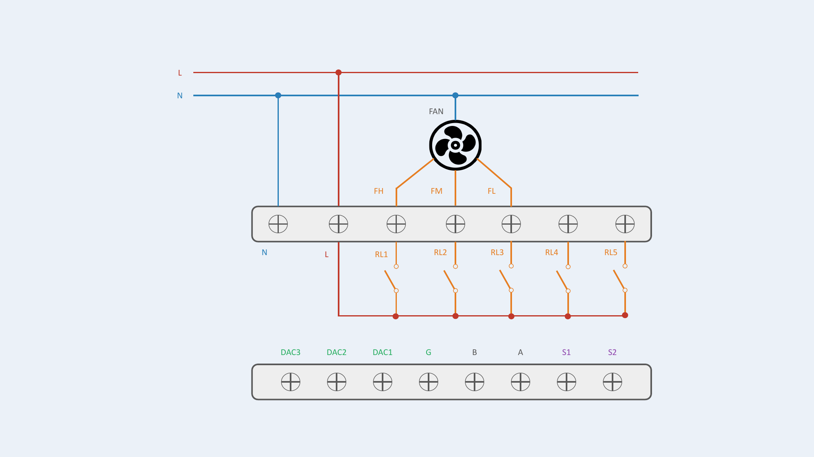
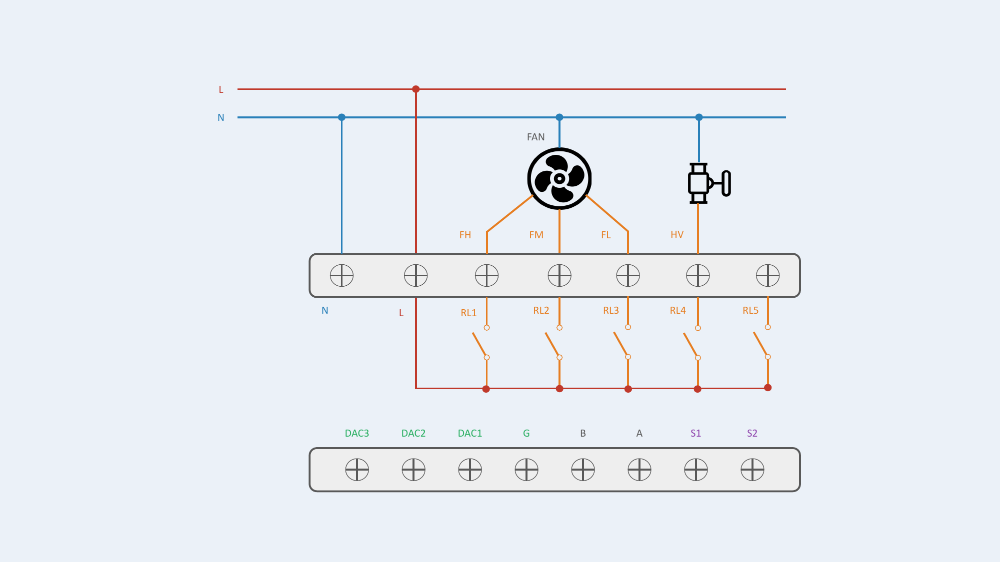
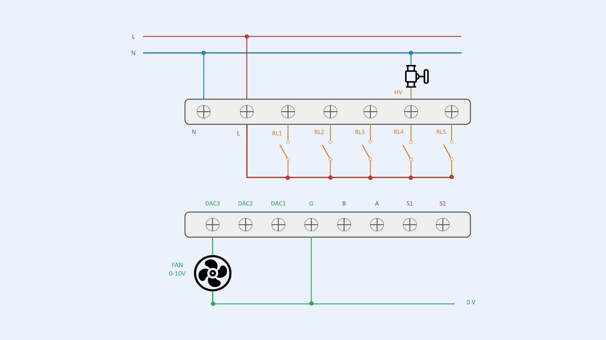
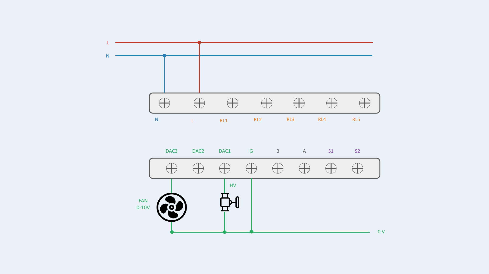
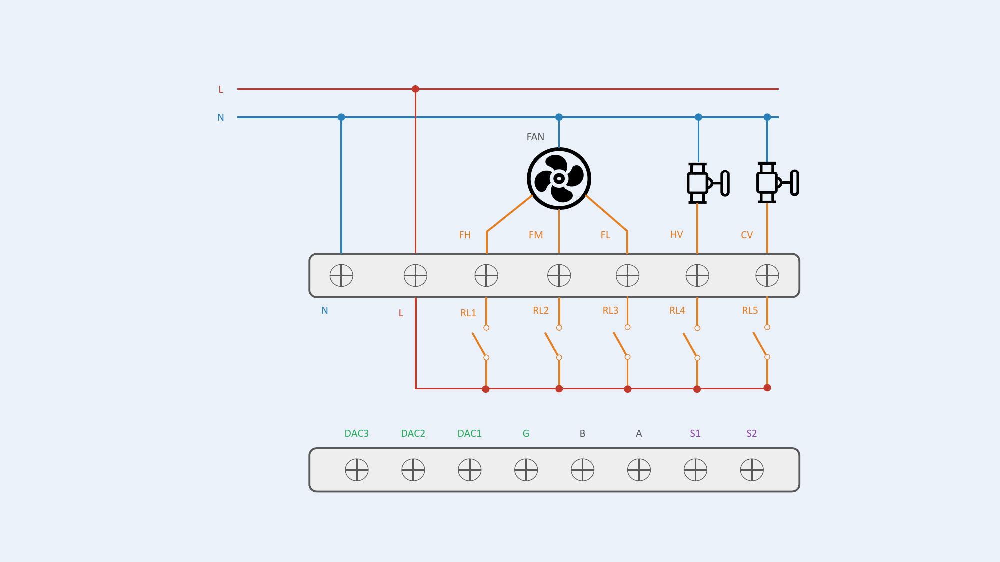
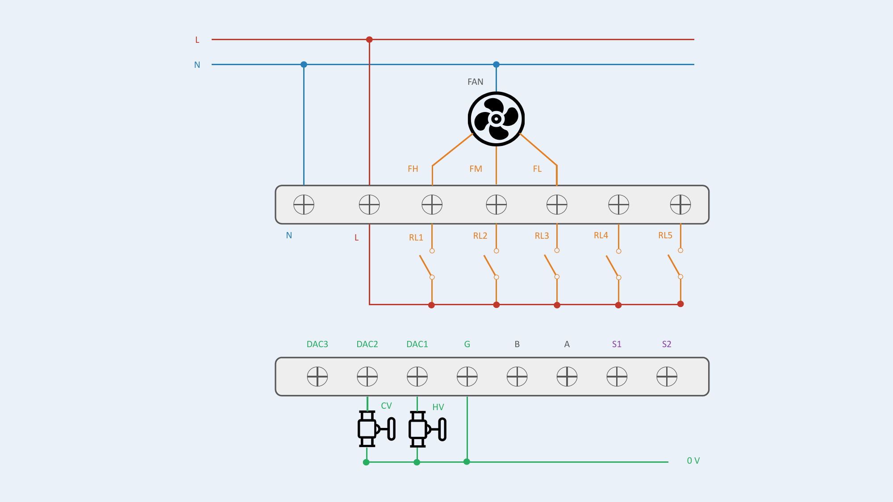
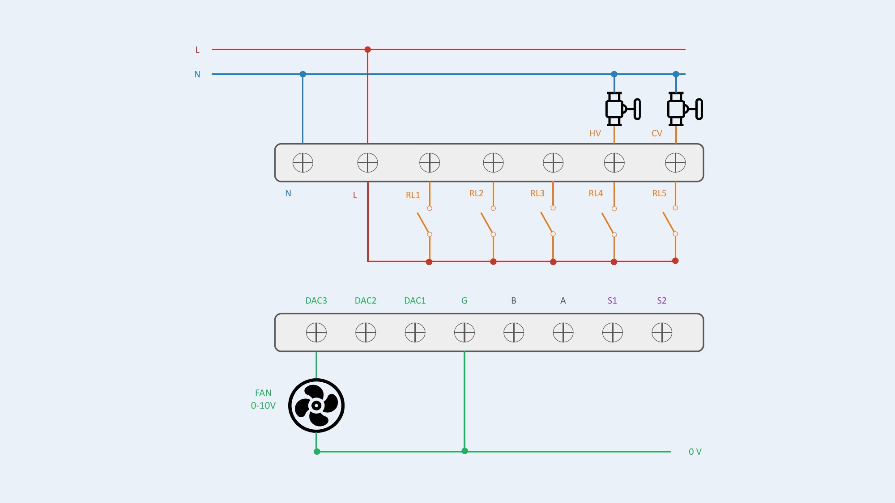
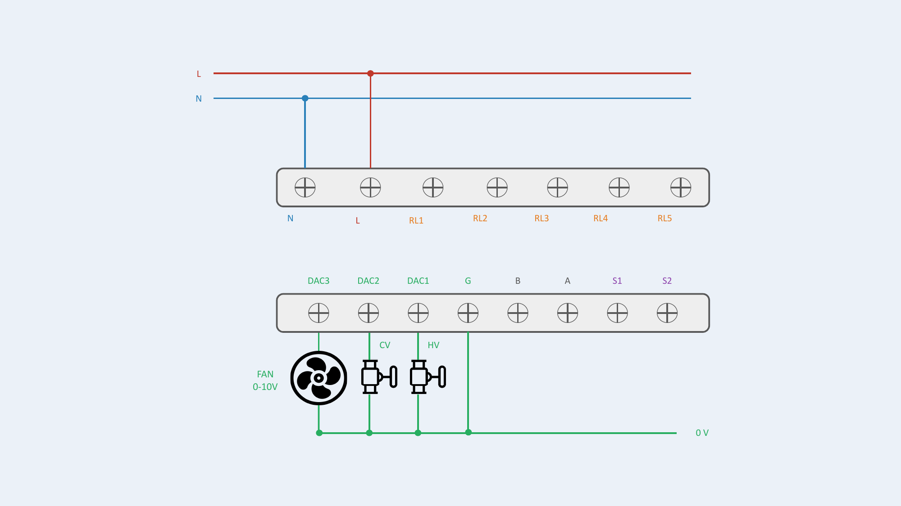
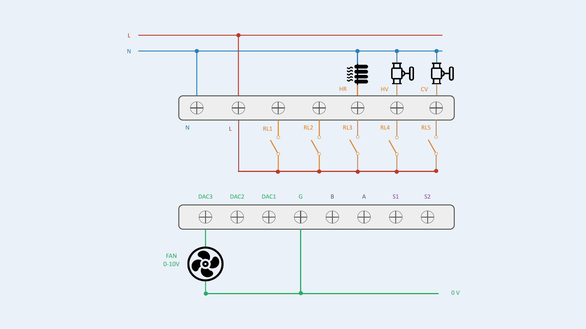
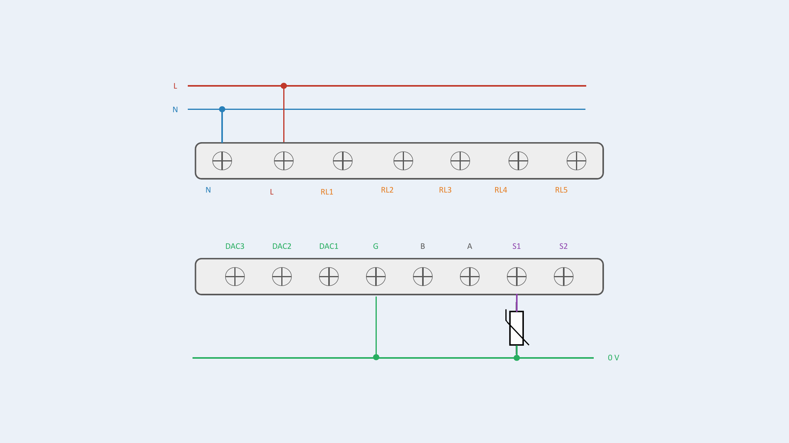

# Configurations de câblage

[Télécharger les schémas de câblage (PDF)](assets/AGR25-01_Schemas_Cablage.pdf){ .md-button .md-button--primary }

## Vue d'ensemble du bornier

| Borne | Nom | Description |
|---|---|---|
| **N** | Neutre | Conducteur neutre |
| **L** | Phase | Conducteur de phase |
| **RL1** | Relais 1 | Sortie TOR 230V~ — Ventilateur vitesse haute (FH) |
| **RL2** | Relais 2 | Sortie TOR 230V~ — Ventilateur vitesse moyenne (FM) |
| **RL3** | Relais 3 | Sortie TOR 230V~ — Ventilateur vitesse basse (FL) — ou résistance selon config. |
| **RL4** | Relais 4 | Sortie TOR 230V~ — Vanne chaude (HV) |
| **RL5** | Relais 5 | Sortie TOR 230V~ — Vanne froide (CV) ou résistance selon config. |
| **G** | Réf. 0V | Référence 0V pour les sorties DAC et les entrées S1/S2 |
| **DAC1** | Sortie 0-10V | Signal proportionnel — Vanne chaude (HV) |
| **DAC2** | Sortie 0-10V | Signal proportionnel — Vanne froide (CV) |
| **DAC3** | Sortie 0-10V | Signal proportionnel — Ventilateur |
| **B** | Réservé | Réservé — ne pas connecter |
| **A** | Réservé | Réservé — ne pas connecter |
| **S1** | Entrée 1 | Capteur externe |
| **S2** | Entrée 2 | Capteur externe |

!!! info "Isolation galvanique"
    Le bornier est séparé en deux zones isolées : **partie 230V~** (N, L, RL1–RL5) et **partie basse tension** (G, DAC1–DAC3, B, A, S1, S2).

### Spécifications de câblage

| Paramètre | Valeur |
|---|---|
| Section de fil — partie 230V (N, L, RL1–RL5) | 1,5 mm² |
| Section de fil — partie BT (G, DAC, S1, S2) | 0,5 à 0,75 mm² |
| Longueur max. câbles DAC 0-10V | 20 m |
| Longueur max. câbles capteurs S1/S2 | 20 m |
| Câble blindé | Recommandé au-delà de 10 m |
| Type de fil | Fil rigide ou fil souple avec embout serti |

## Types de régulation

| Type | Description |
|---|---|
| **TOR (Relais)** | Via les sorties relais RL1–RL5. Inclut le mode 3 vitesses du ventilateur (3 relais TOR, un par vitesse). |
| **0-10V (Proportionnel)** | Via les sorties DAC1–DAC3. Signal analogique proportionnel pour actionneurs modulants. |

## Abréviations des sorties

| Abréviation | Signification |
|---|---|
| FH | Ventilateur vitesse haute (Fan High) |
| FM | Ventilateur vitesse moyenne (Fan Medium) |
| FL | Ventilateur vitesse basse (Fan Low) |
| HV | Vanne chaude (Hot Valve) |
| CV | Vanne froide (Cold Valve) |
| HR | Résistance électrique — via contacteur de puissance externe |
| Fan | Ventilateur (0-10V proportionnel) |
| N/S | Non supporté |

## Symboles des schémas

Les pictogrammes suivants sont utilisés dans les schémas de câblage ci-dessous :

| Symbole | Composant |
|:---:|---|
| { .picto-icon } | **Ventilateur** — Moteur du ventilo-convecteur (3 vitesses ou 0-10V) |
| { .picto-icon } | **Vanne** — Actionneur de vanne chaude (HV) ou froide (CV) |
| { .picto-icon } | **Résistance électrique** — Via contacteur de puissance externe (HR) |

!!! danger "Avertissement de sécurité"
    La résistance électrique (HR) ne doit **JAMAIS** être commutée directement par un relais. Toujours utiliser un contacteur de puissance externe.

## Sans vanne

Ventilo-convecteur sans vanne de régulation.

| # | Configuration | Ventilateur | Vannes | Résistance | Affectation des sorties | Statut |
|---|---|---|---|---|---|---|
| 1 | Ventilateur seul | 3 vitesses | — | — | RL1=FH, RL2=FM, RL3=FL | **OK** |
| 2 | Ventilateur seul | 0-10V | — | — | DAC3=Fan | **OK** |

**Configuration #1 — Ventilateur 3 vitesses**

**Configuration #2 — Ventilateur 0-10V**

## Sans vanne + Résistance électrique

Ventilo-convecteur sans vanne, avec résistance électrique.

| # | Configuration | Ventilateur | Vannes | Résistance | Affectation des sorties | Statut |
|---|---|---|---|---|---|---|
| 3 | Ventilateur + Résistance | 3 vitesses | — | TOR | RL1=FH, RL2=FM, RL3=FL, RL5=HR | **OK** |
| 4 | Ventilateur + Résistance | 0-10V | — | TOR | DAC3=Fan, RL5=HR | **OK** |

!!! danger "Sécurité résistance"
    La résistance électrique (HR) ne doit JAMAIS être commutée directement par un relais. Utiliser un contacteur de puissance externe.

**Configuration #3 — Ventilateur 3 vitesses / Résistance TOR**

**Configuration #4 — Ventilateur 0-10V / Résistance TOR**

## 2 tubes (2T)

Ventilo-convecteur avec 1 vanne (2T mixte, 2T chaud seul ou 2T froid seul). La vanne unique est toujours branchée sur HV : RL4 pour le TOR, DAC1 pour le 0-10V.

| # | Configuration | Ventilateur | Vannes | Résistance | Affectation des sorties | Statut |
|---|---|---|---|---|---|---|
| 5 | 2T : Ventilateur + 1 Vanne | 3 vitesses | TOR | — | RL1=FH, RL2=FM, RL3=FL, RL4=HV | **OK** |
| 6 | 2T : Ventilateur + 1 Vanne | 3 vitesses | 0-10V | — | RL1=FH, RL2=FM, RL3=FL, DAC1=HV | **OK** |
| 7 | 2T : Ventilateur + 1 Vanne | 0-10V | TOR | — | DAC3=Fan, RL4=HV | **OK** |
| 8 | 2T : Ventilateur + 1 Vanne | 0-10V | 0-10V | — | DAC1=HV, DAC3=Fan | **OK** |

**Configuration #5 — Ventilateur 3 vitesses / Vanne TOR**

**Configuration #6 — Ventilateur 3 vitesses / Vanne 0-10V**

**Configuration #7 — Ventilateur 0-10V / Vanne TOR**

**Configuration #8 — Ventilateur 0-10V / Vanne 0-10V**

## 2 tubes + Résistance électrique (2T + 2 fils)

Ventilo-convecteur 2 tubes avec résistance électrique.

| # | Configuration | Ventilateur | Vannes | Résistance | Affectation des sorties | Statut |
|---|---|---|---|---|---|---|
| 9 | 2T + Rés. : Ventilateur + 1 Vanne + Résistance | 3 vitesses | TOR | TOR | RL1=FH, RL2=FM, RL3=FL, RL4=HV, RL5=HR | **OK** |
| 10 | 2T + Rés. : Ventilateur + 1 Vanne + Résistance | 3 vitesses | 0-10V | TOR | RL1=FH, RL2=FM, RL3=FL, DAC1=HV, RL5=HR | **OK** |
| 11 | 2T + Rés. : Ventilateur + 1 Vanne + Résistance | 0-10V | TOR | TOR | DAC3=Fan, RL4=HV, RL5=HR | **OK** |
| 12 | 2T + Rés. : Ventilateur + 1 Vanne + Résistance | 0-10V | 0-10V | TOR | DAC1=HV, DAC3=Fan, RL5=HR | **OK** |

!!! danger "Sécurité résistance"
    La résistance électrique (HR) ne doit JAMAIS être commutée directement par un relais. Utiliser un contacteur de puissance externe.

**Configuration #9 — Ventilateur 3 vitesses / Vanne TOR / Résistance TOR**

**Configuration #10 — Ventilateur 3 vitesses / Vanne 0-10V / Résistance TOR**

**Configuration #11 — Ventilateur 0-10V / Vanne TOR / Résistance TOR**

**Configuration #12 — Ventilateur 0-10V / Vanne 0-10V / Résistance TOR**

## 4 tubes (4T)

Ventilo-convecteur avec 2 vannes indépendantes (chauffage + refroidissement).

| # | Configuration | Ventilateur | Vannes | Résistance | Affectation des sorties | Statut |
|---|---|---|---|---|---|---|
| 13 | 4T : Ventilateur + 2 Vannes | 3 vitesses | TOR | — | RL1=FH, RL2=FM, RL3=FL, RL4=HV, RL5=CV | **OK** |
| 14 | 4T : Ventilateur + 2 Vannes | 3 vitesses | 0-10V | — | RL1=FH, RL2=FM, RL3=FL, DAC1=HV, DAC2=CV | **OK** |
| 15 | 4T : Ventilateur + 2 Vannes | 0-10V | TOR | — | DAC3=Fan, RL4=HV, RL5=CV | **OK** |
| 16 | 4T : Ventilateur + 2 Vannes | 0-10V | 0-10V | — | DAC1=HV, DAC2=CV, DAC3=Fan | **OK** |

**Configuration #13 — Ventilateur 3 vitesses / Vannes TOR**

**Configuration #14 — Ventilateur 3 vitesses / Vannes 0-10V**

**Configuration #15 — Ventilateur 0-10V / Vannes TOR**

**Configuration #16 — Ventilateur 0-10V / Vannes 0-10V**

## 4 tubes + Résistance électrique (4T + 2 fils)

Ventilo-convecteur 4 tubes avec résistance électrique.

| # | Configuration | Ventilateur | Vannes | Résistance | Affectation des sorties | Statut |
|---|---|---|---|---|---|---|
| 17 | 4T + Rés. : Ventilateur + 2 Vannes + Résistance | 3 vitesses | 0-10V | TOR | RL1=FH, RL2=FM, RL3=FL, DAC1=HV, DAC2=CV, RL5=HR | **OK** |
| 18 | 4T + Rés. : Ventilateur + 2 Vannes + Résistance | 0-10V | TOR | TOR | DAC3=Fan, RL4=HV, RL5=CV, RL3=HR | **OK** |
| 19 | 4T + Rés. : Ventilateur + 2 Vannes + Résistance | 0-10V | 0-10V | TOR | DAC1=HV, DAC2=CV, DAC3=Fan, RL5=HR | **OK** |
| 20 | 4T + Rés. : Ventilateur + 2 Vannes + Résistance | 3 vitesses | TOR | TOR | — | **N/S** |

!!! danger "Sécurité résistance"
    La résistance électrique (HR) ne doit JAMAIS être commutée directement par un relais. Utiliser un contacteur de puissance externe.

!!! warning "Configuration #20 — Non supportée"
    Pas assez de relais disponibles pour cette configuration. Si cette configuration est sélectionnée, les sorties restent désactivées par sécurité.

Chaque sortie supporte une logique inversable (NO / NC) configurable individuellement.

**Configuration #17 — Ventilateur 3 vitesses / Vannes 0-10V / Résistance TOR**

**Configuration #18 — Ventilateur 0-10V / Vannes TOR / Résistance TOR**

**Configuration #19 — Ventilateur 0-10V / Vannes 0-10V / Résistance TOR**

## Capteurs externes (S1, S2)

Les entrées S1 et S2 acceptent deux types de capteurs, configurables depuis l'écran ou le serveur AGRID.

### Capteur analogique (Thermistance)

Mesure de température déportée.

| Type de capteur | Connexion | Entrée | Signal | Applications |
|---|---|---|---|---|
| Thermistance | S1 ou S2 + G (réf. 0V) | Analogique | Variation de résistance | Température de soufflage / extérieure / de reprise, détection de changeover (commutation auto chaud/froid en 2 tubes) |

**Notes de câblage :**

- Connecter la thermistance entre S1 (ou S2) et G
- Aucune alimentation externe nécessaire
- 2 fils, sans polarité
- Longueur de câble max. : 20 m

**Thermistances supportées :**

- NTC 5K
- NTC 10K Type II & Type III
- NTC 20K
- PT1000
- PT 500

**Configuration :** le type de capteur doit être défini via l'écran de paramétrage du thermostat ou via l'application AGRID (ou BMS).

### Capteur numérique (Contact sec)

Détection d'état TOR.

| Type de capteur | Connexion | Entrée | Signal | Applications |
|---|---|---|---|---|
| Contact sec (Interrupteur) | S1 ou S2 + G (réf. 0V) | Numérique | État TOR | Détecteur de fenêtre, badge / carte de présence |

**Notes de câblage :**

- Connecter l'interrupteur entre S1 (ou S2) et G
- Aucune alimentation externe nécessaire
- Contact libre de potentiel uniquement
- Longueur de câble max. : 20 m

**Applications :** détecteur d'ouverture de fenêtre, badge / carte de présence, tout contact libre de potentiel.

**Configuration :** le type de capteur doit être défini via l'écran de paramétrage du thermostat ou via l'application AGRID (ou BMS).

### Détecteur de mouvement PIR

Détecteur PIR externe avec sortie contact sec.

| Type de capteur | Connexion | Entrée | Signal | Alimentation |
|---|---|---|---|---|
| Détecteur de mouvement PIR | S1 ou S2 + G (réf. 0V) | Numérique | TOR (contact sec) | Externe (alimentation séparée) |

**Notes de câblage :**

- Connecter la sortie contact sec du PIR entre S1 (ou S2) et G
- Le détecteur PIR nécessite sa propre alimentation externe
- Se référer au manuel du capteur PIR pour les spécifications d'alimentation

**Configuration :** le type de capteur doit être défini via l'écran de paramétrage du thermostat ou via l'application AGRID (ou BMS).

!!! warning "Alimentation externe requise"
    Le capteur PIR nécessite une alimentation externe. Se référer aux instructions du capteur PIR pour garantir une isolation galvanique et une sécurité adéquates lors du raccordement au thermostat. L'alimentation externe doit être isolée de la zone basse tension du thermostat.

