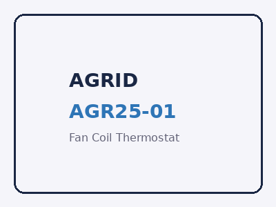

# Documentation AGRID

Bienvenue dans la documentation officielle des produits AGRID. Découvrez nos solutions de régulation thermique innovantes pour ventilo-convecteurs.

## Produits disponibles

=== "AGR25-01"

    {: style="height:200px"}

    **Thermostat pour ventilo-convecteurs**

    - **Modèle:** AGR25-01
    - **Fabricant:** Beijing Breeze Technology Co., Ltd.
    - **Importateur:** AGRID SAS (Paris)
    - **Alimentation:** 220-240V~ 50Hz
    - **Écran:** Tactile couleur 4 pouces
    - **Connectivité:** WiFi 2.4GHz
    - **Sorties:** 5 relais SPST-NO + 3 DAC 0-10V

    [Voir la documentation complète](fan-coil/agr25-01/index.md){ .md-button .md-button--primary }

## À propos d'AGRID

AGRID SAS est l'importateur français des solutions de régulation thermique professionnelles développées par Beijing Breeze Technology Co., Ltd.

Basée à Paris, AGRID propose des produits innovants conçus pour les applications de climatisation et chauffage via ventilo-convecteurs, avec une attention particulière à la connectivité WiFi et aux interfaces utilisateur intuitives.
